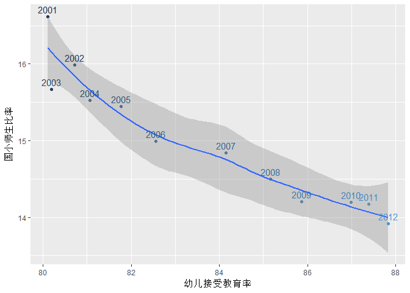

歐洲國家教育水平分析及教育與移民傾向的關係
================

報告人
------

陳堯奕

資料來源
--------

世界銀行網站（<http://data.worldbank.org/>）

資料介紹
--------

資料記錄了歐洲大部分國家21世紀的各項教育與移民數據。欄位包括幼儿接受教育率、年度公共教育支出(Million PPS)、平均对每名学生的教育支出(PPS)、本国国际学生（大学）人员流动性、中等教育水平学生平均掌握外语数、教育支出占国家年度总GDP百分比、应届毕业生就业率率、国民终生受教育率、20至24岁拥有高中学历人数比例、30至34岁拥有大学学历人数比例、Immigration、Emigration、Net Migration、Total Migration等。

資料格式
--------

資料格式為csv

``` r
library(readxl)
```

    ## Warning: package 'readxl' was built under R version 3.3.3

``` r
ed1 <- read_excel("F:/大学课程/大数据/移民/教育综合1.xls")
ed2 <- read_excel("F:/大学课程/大数据/移民/教育综合2.xls")
ed3 <- read_excel("F:/大学课程/大数据/移民/个人受教育后就业率.xls")
ed4 <- read_excel("F:/大学课程/大数据/移民/移民表格已整理.xlsx")
library(dplyr)
```

    ## Warning: package 'dplyr' was built under R version 3.3.3

    ## 
    ## Attaching package: 'dplyr'

    ## The following objects are masked from 'package:stats':
    ## 
    ##     filter, lag

    ## The following objects are masked from 'package:base':
    ## 
    ##     intersect, setdiff, setequal, union

``` r
ed<-merge(ed1,ed2,all = T)
ed<-merge(ed,ed3,all = T)
ed<-merge(ed,ed4,all = T)
ed$'本国国际学生（大学）人员流动性'<-as.numeric(ed$'本国国际学生（大学）人员流动性')
```

    ## Warning: 强制改变过程中产生了NA

``` r
ed$`学生出国留学（大学）人员流动性`<-as.numeric(ed$`学生出国留学（大学）人员流动性`)
```

    ## Warning: 强制改变过程中产生了NA

``` r
ed$'20至24岁拥有高中学历人数比例'<-as.numeric(ed$'20至24岁拥有高中学历人数比例')
```

    ## Warning: 强制改变过程中产生了NA

``` r
ed$`30至34岁拥有大学学历人数比例`<-as.numeric(ed$`30至34岁拥有大学学历人数比例`)
```

    ## Warning: 强制改变过程中产生了NA

``` r
ed$Immigration<-as.numeric(ed$Immigration)
```

    ## Warning: 强制改变过程中产生了NA

``` r
ed$Emigration<-as.numeric(ed$Emigration)
```

    ## Warning: 强制改变过程中产生了NA

``` r
ed$幼儿接受教育率<-as.numeric(ed$幼儿接受教育率)
```

    ## Warning: 强制改变过程中产生了NA

``` r
ed$`年度公共教育支出(Million PPS)`<-as.numeric(ed$`年度公共教育支出(Million PPS)`)
```

    ## Warning: 强制改变过程中产生了NA

``` r
ed$`平均对每名学生的教育支出(PPS)`<-as.numeric(ed$`平均对每名学生的教育支出(PPS)`)
```

    ## Warning: 强制改变过程中产生了NA

``` r
ed$国小师生比率<-as.numeric(ed$国小师生比率)
```

    ## Warning: 强制改变过程中产生了NA

``` r
ed$中等教育水平学生平均掌握外语数<-as.numeric(ed$中等教育水平学生平均掌握外语数)
```

    ## Warning: 强制改变过程中产生了NA

``` r
ed$教育支出占国家年度总GDP百分百<-as.numeric(ed$教育支出占国家年度总GDP百分百)
```

    ## Warning: 强制改变过程中产生了NA

``` r
ed$应届毕业生就业率<-as.numeric(ed$应届毕业生就业率)
```

    ## Warning: 强制改变过程中产生了NA

``` r
ed$国民终生受教育率<-as.numeric(ed$国民终生受教育率)
```

    ## Warning: 强制改变过程中产生了NA

``` r
ed$个人受教育后就业率<-as.numeric(ed$个人受教育后就业率)
```

    ## Warning: 强制改变过程中产生了NA

``` r
ed$在读大学生平均年龄<-as.numeric(ed$在读大学生平均年龄)
```

    ## Warning: 强制改变过程中产生了NA

``` r
knitr::kable(ed[233:248,])
```

|     | Country |  Year| 幼儿接受教育率 | 在读大学生平均年龄 | 年度公共教育支出(Million PPS) | 平均对每名学生的教育支出(PPS) | 学生出国留学（大学）人员流动性 | 本国国际学生（大学）人员流动性 | 国小师生比率 | 中等教育水平学生平均掌握外语数 | 教育支出占国家年度总GDP百分百 | 应届毕业生就业率 | 国民终生受教育率 | 20至24岁拥有高中学历人数比例 | 30至34岁拥有大学学历人数比例 | 个人受教育后就业率 |   ID|  Immigration|  Emigration|  Net Migration|  Total Migration|
|-----|:--------|-----:|:--------------:|:------------------:|:-----------------------------:|:-----------------------------:|:------------------------------:|:------------------------------:|:------------:|:------------------------------:|:-----------------------------:|:----------------:|:----------------:|:----------------------------:|:----------------------------:|:------------------:|----:|------------:|-----------:|--------------:|----------------:|
| 233 | Denmark |  2000|       NA       |         NA         |            11216.0            |             7108.0            |               NA               |               NA               |      NA      |               NA               |              8.28             |        NA        |       19.4       |              NA              |             32.1             |         NA         |   NA|           NA|          NA|             NA|               NA|
| 234 | Denmark |  2001|      93.7      |        24.8        |            11402.0            |             7288.5            |               4.7              |               5.2              |     10.2     |               NA               |              8.44             |        NA        |       18.4       |              NA              |             32.9             |         NA         |   NA|           NA|          NA|             NA|               NA|
| 235 | Denmark |  2002|      93.5      |        24.8        |            11897.1            |             7360.8            |               4.8              |               5.6              |     10.9     |               NA               |              8.44             |        NA        |       18.0       |              NA              |             34.2             |         NA         |    4|        52778|       43481|           9297|            96259|
| 236 | Denmark |  2003|      94.9      |        24.9        |            11525.8            |             7115.0            |               5.0              |               6.7              |     10.8     |               NA               |              8.33             |        NA        |       24.2       |              NA              |             38.2             |         NA         |   50|        49754|       43466|           6288|            93220|
| 237 | Denmark |  2004|      96.9      |        25.3        |            12365.9            |             7631.1            |               5.1              |               7.3              |     11.3     |               2.0              |              8.43             |       82.6       |       25.6       |             76.2             |             41.4             |         NA         |   96|        49860|       45017|           4843|            94877|
| 238 | Denmark |  2005|      91.8      |        25.6        |            12476.5            |             8075.0            |               5.0              |               8.7              |      NA      |               2.0              |              8.30             |       86.4       |       27.4       |             77.1             |             43.1             |         NA         |  142|        52458|       45869|           6589|            98327|
| 239 | Denmark |  2006|      92.0      |        25.5        |            12696.3            |             8385.8            |               5.5              |               9.8              |      NA      |               2.0              |              7.97             |       89.0       |       29.2       |             77.4             |             43.0             |         NA         |  188|        56750|       46786|           9964|           103536|
| 240 | Denmark |  2007|      92.7      |        25.5        |            13036.8            |             8680.2            |               5.5              |              10.8              |      NA      |               2.0              |              7.81             |       90.9       |       29.1       |             69.4             |             38.1             |         NA         |  234|        64656|       41566|          23090|           106222|
| 241 | Denmark |  2008|      91.8      |        25.2        |            13119.6            |             8907.0            |               5.2              |              12.2              |     10.1     |               1.9              |              7.68             |       90.6       |       30.0       |             68.9             |             39.2             |         NA         |  280|        57357|       38356|          19001|            95713|
| 242 | Denmark |  2009|      91.9      |        25.2        |            13960.4            |             9148.7            |               5.4              |              15.1              |      9.9     |               1.9              |              8.74             |       87.9       |       31.3       |             69.9             |             40.7             |         NA         |  326|        51800|       39899|          11901|            91699|
| 243 | Denmark |  2010|      98.1      |        24.8        |            15240.4            |             9589.2            |               5.5              |              17.6              |     11.5     |               1.8              |              8.81             |       83.5       |       32.6       |             68.6             |             41.2             |         NA         |  372|        52236|       41456|          10780|            93692|
| 244 | Denmark |  2011|      97.9      |        24.6        |            15329.5            |             9665.1            |               5.7              |              21.0              |     11.8     |               1.8              |              8.75             |       83.0       |       32.3       |             70.0             |             41.2             |         NA         |  418|        52833|       41593|          11240|            94426|
| 245 | Denmark |  2012|      98.0      |        24.5        |               NA              |               NA              |               5.9              |              23.5              |     11.9     |               1.8              |               NA              |       84.1       |       31.6       |             72.0             |             43.0             |         NA         |  464|        54409|       43663|          10746|            98072|
| 246 | Denmark |  2013|       NA       |         NA         |               NA              |               NA              |               NA               |               NA               |      NA      |               NA               |               NA              |       81.9       |       31.4       |             71.8             |             43.4             |         NA         |  510|        60312|       43310|          17002|           103622|
| 247 | Denmark |  2014|       NA       |         NA         |               NA              |               NA              |               NA               |               NA               |      NA      |               NA               |               NA              |       83.7       |       31.9       |             72.5             |             44.9             |         NA         |   NA|           NA|          NA|             NA|               NA|
| 248 | Denmark |  2015|       NA       |         NA         |               NA              |               NA              |               NA               |               NA               |      NA      |               NA               |               NA              |       81.7       |       31.3       |             74.1             |             47.6             |         NA         |   NA|           NA|          NA|             NA|               NA|

資料量較大，這裡象征性的顯示其中幾筆資料（丹麥）。

分析議題
--------

歐洲28國在進入21世紀對本國教育方面的重視程度及教育水平的變化，并將其與移民傾向做對比分析。

假設
----

歐洲總體教育水平呈逐年上升趨勢；教育水平發展與移民傾向有關，國家教育水平會對移民意願產生影響並且是正面影響，教育水平越高的國家其移入人口越多。

分析結果
--------

``` r
年均人口流動總數<-group_by(ed,Country)%>%
  summarise(年均人口流動總數=mean(`Total Migration`,na.rm=T)) %>%
  arrange(desc(年均人口流動總數))

歐盟28國平均數據<-filter(ed,Country %in%"EU (28 countries)")
for(i in 3:15){
歐盟28國平均數據[i]<-mean(歐盟28國平均數據[,i],na.rm = T)
}

歐洲5國數據<-filter(ed,Country %in% c('Germany','United Kingdom','Spain',"France","Italy"))
歐洲5國平均數據<-group_by(歐洲5國數據,Country)%>%summarise(幼儿接受教育率=mean(幼儿接受教育率,na.rm=T),'年度公共教育支出(Million PPS)'=mean(`年度公共教育支出(Million PPS)`,na.rm=T),'平均对每名学生的教育支出(PPS)'=mean(`平均对每名学生的教育支出(PPS)`,na.rm=T),`本国国际学生（大学）人员流动性`=mean(`本国国际学生（大学）人员流动性`,na.rm=T),中等教育水平学生平均掌握外语数=mean(中等教育水平学生平均掌握外语数,na.rm=T),教育支出占国家年度总GDP百分比=mean(教育支出占国家年度总GDP百分百,na.rm=T),应届毕业生就业率=mean(应届毕业生就业率,na.rm=T),国民终生受教育率=mean(国民终生受教育率,na.rm=T),'20至24岁拥有高中学历人数比例'=mean(`20至24岁拥有高中学历人数比例`,na.rm=T),'30至34岁拥有大学学历人数比例'=mean(`30至34岁拥有大学学历人数比例`,na.rm=T),Immigration=mean(Immigration,na.rm=T),Emigration=mean(Emigration,na.rm=T),'Net Migration'=mean(`Net Migration`,na.rm=T),'Total Migration'=mean(`Total Migration`,na.rm=T),个人受教育后就业率=mean(个人受教育后就业率,na.rm=T),在读大学生平均年龄=mean(在读大学生平均年龄,na.rm=T),`学生出国留学（大学）人员流动性`=mean(`学生出国留学（大学）人员流动性`,na.rm=T),国小师生比率=mean(国小师生比率,na.rm=T))

cm<-group_by(ed,Country)%>%summarise(幼儿接受教育率=mean(幼儿接受教育率,na.rm=T),'年度公共教育支出(Million PPS)'=mean(`年度公共教育支出(Million PPS)`,na.rm=T),'平均对每名学生的教育支出(PPS)'=mean(`平均对每名学生的教育支出(PPS)`,na.rm=T),`本国国际学生（大学）人员流动性`=mean(`本国国际学生（大学）人员流动性`,na.rm=T),中等教育水平学生平均掌握外语数=mean(中等教育水平学生平均掌握外语数,na.rm=T),教育支出占国家年度总GDP百分比=mean(教育支出占国家年度总GDP百分百,na.rm=T),应届毕业生就业率=mean(应届毕业生就业率,na.rm=T),国民终生受教育率=mean(国民终生受教育率,na.rm=T),'20至24岁拥有高中学历人数比例'=mean(`20至24岁拥有高中学历人数比例`,na.rm=T),'30至34岁拥有大学学历人数比例'=mean(`30至34岁拥有大学学历人数比例`,na.rm=T),Immigration=mean(Immigration,na.rm=T),Emigration=mean(Emigration,na.rm=T),'Net Migration'=mean(`Net Migration`,na.rm=T),'Total Migration'=mean(`Total Migration`,na.rm=T),个人受教育后就业率=mean(个人受教育后就业率,na.rm=T),在读大学生平均年龄=mean(在读大学生平均年龄,na.rm=T),`学生出国留学（大学）人员流动性`=mean(`学生出国留学（大学）人员流动性`,na.rm=T),国小师生比率=mean(国小师生比率,na.rm=T))
cm$Country<-as.factor(cm$Country)
cm<-cm[-(14:18),]
cm<-cm[-c(23,47),]
tm<-group_by(ed,Year)%>%summarise(幼儿接受教育率=mean(幼儿接受教育率,na.rm=T),'年度公共教育支出(Million PPS)'=mean(`年度公共教育支出(Million PPS)`,na.rm=T),'平均对每名学生的教育支出(PPS)'=mean(`平均对每名学生的教育支出(PPS)`,na.rm=T),`本国国际学生（大学）人员流动性`=mean(`本国国际学生（大学）人员流动性`,na.rm=T),中等教育水平学生平均掌握外语数=mean(中等教育水平学生平均掌握外语数,na.rm=T),教育支出占国家年度总GDP百分比=mean(教育支出占国家年度总GDP百分百,na.rm=T),应届毕业生就业率=mean(应届毕业生就业率,na.rm=T),国民终生受教育率=mean(国民终生受教育率,na.rm=T),'20至24岁拥有高中学历人数比例'=mean(`20至24岁拥有高中学历人数比例`,na.rm=T),'30至34岁拥有大学学历人数比例'=mean(`30至34岁拥有大学学历人数比例`,na.rm=T),Immigration=mean(Immigration,na.rm=T),Emigration=mean(Emigration,na.rm=T),'Net Migration'=mean(`Net Migration`,na.rm=T),'Total Migration'=mean(`Total Migration`,na.rm=T),个人受教育后就业率=mean(个人受教育后就业率,na.rm=T),在读大学生平均年龄=mean(在读大学生平均年龄,na.rm=T),`学生出国留学（大学）人员流动性`=mean(`学生出国留学（大学）人员流动性`,na.rm=T),国小师生比率=mean(国小师生比率,na.rm=T))
```

各國對其教育產業的重視程度
--------------------------

``` r
library(ggplot2) 
```

    ## Warning: package 'ggplot2' was built under R version 3.3.3

``` r
#各國年均公共教育支出(Million PPS)
ggplot(arrange(cm,desc(`年度公共教育支出(Million PPS)`))[1:11,], 
       aes(x = reorder(Country, desc(`年度公共教育支出(Million PPS)`)), 
           y = `年度公共教育支出(Million PPS)`,colour=Country,
           title(main ="各國平均年度公共教育支出(Million PPS)"))) + 
  geom_bar(stat = "identity")+
  geom_text(aes(label = round(`年度公共教育支出(Million PPS)`), vjust = -0.5, hjust = 0.5)) 
```


``` r
#各國平均一年对每名学生的教育支出(PPS)
ggplot(arrange(cm,desc(`平均对每名学生的教育支出(PPS)`))[1:10,], 
       aes(x = reorder(Country, desc(`平均对每名学生的教育支出(PPS)`)), 
           y = `平均对每名学生的教育支出(PPS)`,colour=Country,
           title(main ="各國平均一年对每名学生的教育支出(PPS)"))) + 
  geom_bar(stat = "identity")+
  geom_text(aes(label = round(`平均对每名学生的教育支出(PPS)`), vjust = -0.5, hjust = 0.5))
```


``` r
#各國年均教育支出占国家年度总GDP百分比
ggplot(arrange(cm,desc(教育支出占国家年度总GDP百分比))[1:10,], 
       aes(x = reorder(Country, desc(教育支出占国家年度总GDP百分比)), 
           y = 教育支出占国家年度总GDP百分比,colour=Country)) + 
  geom_bar(stat = "identity")+
  geom_text(aes(label = round(教育支出占国家年度总GDP百分比,2), vjust = -0.5, hjust = 0.5))
```


從這三張圖可以看到，年均教育支出高的國家可以表明其教育產業的大小，但不一定就代表對教育事業的重視。而那些年均對每一名學生支出高的國家其年均總教育支出不一定高，但其教育支出額占GDP百分比基本都名列前茅。

``` r
#各國应届毕业生就业率與个人受教育后就业率
ggplot(arrange(cm,desc(应届毕业生就业率))[2:11,], 
       aes(x = Country, 
           y = 个人受教育后就业率,colour=Country)) + 
  geom_bar(stat = "identity",mapping = aes(x = reorder(Country, desc(应届毕业生就业率)), 
                                           y = 应届毕业生就业率,colour=Country))+
  geom_text(aes(label = round(个人受教育后就业率,1)))+theme(legend.position='none')+
  geom_text(aes(label = round(应届毕业生就业率,1),
                vjust = (个人受教育后就业率-应届毕业生就业率)/2.7))+
  ylab("个人受教育后就业率與应届毕业生就业率")
```

    ## Warning: Removed 1 rows containing missing values (geom_text).

    ## Warning: Removed 1 rows containing missing values (geom_text).


``` r
#上圖當中偏上的數值代表应届毕业生就业率，偏下的數值代表个人受教育后就业率（高中及以下學歷）。

#各國国民终生受教育率
ggplot(arrange(cm,desc(国民终生受教育率))[2:10,], 
       aes(x = reorder(Country, desc(国民终生受教育率)), 
           y = 国民终生受教育率,colour=Country)) + 
  geom_bar(stat = "identity")+theme(legend.position='none')+
  geom_text(aes(label = round(国民终生受教育率,1), vjust = -0.5, hjust = 0.5))
```


更直觀的地看，應屆畢業生就業率和受教育人員就業率和國民終生受教育率最高的幾個國家也基本都是教育支出額占GDP百分比和年均對每一名學生支出最高的國家。所以這兩項數據可以更直觀地看出這一國家的教育水平。

應屆畢業生就業率與受過教育人員（高中及以下學歷）就業率的關係
------------------------------------------------------------

``` r
#应届毕业生就业率與个人受教育后就业率的關係
ggplot(cm[-28,], 
       aes(x = 应届毕业生就业率, 
           y = 个人受教育后就业率,
           title(main ="应届毕业生就业率與个人受教育后就业率的關係")))+geom_point()+
  theme(legend.position='none')+geom_smooth()+
  geom_text(aes(label = Country, vjust = -0.5, hjust = 0.5))
```

    ## `geom_smooth()` using method = 'loess'

    ## Warning: Removed 17 rows containing non-finite values (stat_smooth).

    ## Warning: Removed 17 rows containing missing values (geom_point).

    ## Warning: Removed 17 rows containing missing values (geom_text).


從圖中可以看出，各國應屆畢業生就業率與受過教育人員就業率基本是成正比的關係。說明一個國家教育環境的好壞在不同教育階層都可以體現；環境好的國家不管是大學的高等教育，還是初、中等的基礎教育都是不錯的。

國家對每學生的支出與應屆畢業生就業率的關係
------------------------------------------

``` r
#5國平均对每名学生的教育支出(PPS)變化趨勢
ggplot(filter(歐洲5國數據,Year>1999,Year<2012), 
       aes(x = Year, 
           y = `平均对每名学生的教育支出(PPS)`,colour=Country,
           title(main ="5國平均对每名学生的教育支出(PPS)變化趨勢"))) + 
  geom_line()
```

    ## Warning: Removed 1 rows containing missing values (geom_path).


``` r
#5國应届毕业生就业率變化趨勢
ggplot(filter(歐洲5國數據,Year>2003), 
       aes(x = Year, 
           y = 应届毕业生就业率,colour=Country,title(main ="5國应届毕业生就业率變化趨勢"))) + 
  geom_line()
```


這裡選擇年均教育支出最大的五個國家來看其平均對一人教育支出的變化，各國對每學生的支出在08年前都是呈上升趨，對應到應屆畢業生就業率方面在08年前變化也都相對平穩。而在08年之後，只有德國繼續保持明顯上升趨勢，可以看到其應屆畢業生就業率也是穩中有升，逐漸和其他各國拉開差距。而西班牙和意大利的教育支出在這年之後則明顯開始下降，與其他三國的差距越來越大，對應其應屆畢業生就業率也都是極具走低。這些都可以看出政府對教育資源的投入與國民的就業能力是有關係的。

歐洲整體教育產業的發展
----------------------

``` r
#歐洲整體教育支出占国家年度总GDP百分比與年度公共教育支出的變化
ggplot(tm[-(1:9),], 
       aes(x = 教育支出占国家年度总GDP百分比, 
           y = `年度公共教育支出(Million PPS)`,colour=Year,
           title(main ="")))+geom_point()+
  theme(legend.position='none')+
  geom_text(aes(label = Year, vjust = -0.5, hjust = 0.5))
```

    ## Warning: Removed 4 rows containing missing values (geom_point).

    ## Warning: Removed 4 rows containing missing values (geom_text).


從整個歐洲平均來看，一開始其年均教育總支出逐年上升，到07年達到頂峰，之後開始便維持在10萬（Million PPS）左右。然而其支出占GDP百分比在這年之後雖有上升過但現在已經有下降的趨勢。是因為國家沒錢了所以不想在投入教育產業嗎？把這兩項數據對比；09年的教育金額支出與08年差不多，但占總GDP百分比卻上升了很多，說明就算當時歐洲整體沒錢也沒有放鬆對教育產業的投入。而在這之後GDP百分比下滑的原因其一可能是大部分國家教育事業的發展已走上規範的軌道，每年的投入基本固定；但也有可能歐洲教育發展已達到了一個瓶頸，雖然經濟好了，但各國不願意再加大投入了。

``` r
#歐洲整體幼儿接受教育率與国小师生比率的變化
ggplot(tm[-(1:9),], 
       aes(x = 幼儿接受教育率, 
           y = 国小师生比率,colour=Year,
           title(main ="")))+geom_point()+
  theme(legend.position='none')+geom_smooth()+
  geom_text(aes(label = Year, vjust = -0.5, hjust = 0.5))
```

    ## `geom_smooth()` using method = 'loess'

    ## Warning: Removed 4 rows containing non-finite values (stat_smooth).

    ## Warning: Removed 4 rows containing missing values (geom_point).

    ## Warning: Removed 4 rows containing missing values (geom_text).



歐洲整體教育環境的改善從幼兒接受教育率的和国小师生比率的變化也可以看出来，都是明顯呈逐年上升趨勢的。

移民數據分析
------------

``` r
#各國年均人口流動總數
ggplot(arrange(年均人口流動總數,desc(年均人口流動總數))[1:10,], 
       aes(x = reorder(Country, desc(年均人口流動總數)), 
           y = 年均人口流動總數,colour=Country)) + 
  geom_bar(stat = "identity")+
  geom_text(aes(label = round(年均人口流動總數,1), vjust = -0.5, hjust = 0.5))
```


因為國家數量較多，這裡選取人口流動量最大的五個國家，即德國、英國、西班牙、法國、意大利，來分析教育方面因素對人口移民的影響。

幼兒教育與本國遷出人口的關係
----------------------------

``` r
#5國年年均遷出人口
ggplot(歐洲5國平均數據, 
       aes(x = reorder(Country, desc(Emigration)), 
           y = Emigration,colour=Country)) + 
  geom_bar(stat = "identity")+theme(legend.position='none')+
  geom_text(aes(label = round(Emigration,1), vjust = -0.5, hjust = 0.5))
```


``` r
#5國平均国小师生比率與幼儿接受教育率
ggplot(歐洲5國平均數據, 
       aes(x = Country, 
           y = 国小师生比率,colour=Country)) + 
  geom_bar(stat = "identity",mapping = aes(x = reorder(Country, desc(幼儿接受教育率)), 
                                           y = 幼儿接受教育率,colour=Country))+
  geom_text(aes(label = round(国小师生比率,1)))+theme(legend.position='none')+
  geom_text(aes(label = round(幼儿接受教育率,1),
                vjust = (国小师生比率-幼儿接受教育率)/3.05))+
  ylab("国小师生比率與幼儿接受教育率")
```


``` r
#上圖當中偏上的數值代表幼儿接受教育率，偏下的數值代表国小师生比率。
```

通過上面兩張圖對比可以看到，幼兒受教育率越高的國家移出境人數越低。可見教育因素對歐洲人口移民是有一定影響的。

``` r
#5國遷出人數變化趨勢
ggplot(filter(歐洲5國數據,Year>2001,Year<2014), 
       aes(x = Year, 
           y = Emigration,colour=Country,title(main ="5國遷出人數變化趨勢"))) + 
  geom_line()
```

    ## Warning: Removed 4 rows containing missing values (geom_path).


``` r
#5國幼儿接受教育率變化趨勢
ggplot(filter(歐洲5國數據,Year>2001,Year<2013), 
       aes(x = Year, 
           y = 幼儿接受教育率,colour=Country,title(main ="5國幼儿接受教育率變化趨勢"))) +geom_line()
```


同時，從數值變化方的面來看，德國幼兒受教育率逐年快速上升，對應其出境人數從08年開始急劇下降。英國幼兒受教育率先減后增，對應其出境人數也是先上升到08年開始逐漸下降。西班牙的幼兒受教育率逐年下降而其出境人數則逐年上升，這些對比都可以看出兩者間是有一定關係的。

教育資金投入與移民的關係
------------------------

``` r
#5國平均年度公共教育支出(Million PPS)
ggplot(歐洲5國平均數據, 
       aes(x = reorder(Country, desc(`年度公共教育支出(Million PPS)`)), 
           y = `年度公共教育支出(Million PPS)`,colour=Country)) + 
  geom_bar(stat = "identity")+
  geom_text(aes(label = round(`年度公共教育支出(Million PPS)`,2), vjust = -0.4, hjust = 0.5))
```


``` r
#各國平均一年对每名学生的教育支出(PPS)
ggplot(歐洲5國平均數據, 
       aes(x = reorder(Country, desc(`平均对每名学生的教育支出(PPS)`)), 
           y = `平均对每名学生的教育支出(PPS)`,colour=Country,
           title(main ="各國平均一年对每名学生的教育支出(PPS)"))) + 
  geom_bar(stat = "identity")+
  geom_text(aes(label = round(`平均对每名学生的教育支出(PPS)`), vjust = -0.4))
```


在教育支出方面，年均總支出和人均支出這兩項意大利和西班牙都是是最低的（對應其出境人數則逐年上升）。而德國在這兩項當中分別是第一和第二（對應其出境人數則逐年下降）。

``` r
#5國年均对每名学生的教育支出(PPS)變化趨勢
ggplot(filter(歐洲5國數據,Year>1999,Year<2012), 
       aes(x = Year, 
           y = `平均对每名学生的教育支出(PPS)`,colour=Country,title(main ="5國平均对每名学生的教育支出(PPS)變化趨勢"))) + 
  geom_line()
```

    ## Warning: Removed 1 rows containing missing values (geom_path).


從變化趨勢來看，各國在08年前都是呈上升趨，而在08年之後，只有德國繼續保持明顯上升趨勢，對應其出境人數也極具下降，在11年已上升為五國中最高。而西班牙和意大利則明顯開始下降，與其他三國的差距越來越大，和其遷移出境人數的變化也有一定關係。

大學留學生人數與移民的關係
--------------------------

``` r
#5國年均遷入人數變化趨勢
ggplot(filter(歐洲5國數據,Year>2001,Year<2014), 
       aes(x = Year, 
           y = Immigration,colour=Country,title(main ="5國遷入人數變化趨勢"))) + 
  geom_line()
```

    ## Warning: Removed 4 rows containing missing values (geom_path).


``` r
#各國留学（大学）人员流动性圖
ggplot(歐洲5國平均數據, 
         aes(x = Country, 
             y = `学生出国留学（大学）人员流动性`,colour=Country)) + 
  geom_bar(stat = "identity",mapping = aes(x = reorder(Country, desc(`本国国际学生（大学）人员流动性`)), 
                                           y = `本国国际学生（大学）人员流动性`,colour=Country))+
  geom_text(aes(label = round(`学生出国留学（大学）人员流动性`,1)))+theme(legend.position='none')+
  geom_text(aes(label = round(`本国国际学生（大学）人员流动性`,1),
    vjust = (`学生出国留学（大学）人员流动性`-`本国国际学生（大学）人员流动性`)/4.47))
```


``` r
#上圖當中柱狀圖數據代表外來国际学生（大学）人员流动性，另一數字代表学生出国留学（大学）人员流动性。
```

國際留學生最多的英國，每年外來移民人口基本保持在50萬以上，且數量整體呈上升趨勢。國際留學生第二多的是德國，其年平均外來移民數量是五國當中最多的，移入人口的趨勢雖然一度下滑，但之後就逐漸回升以至其先前水準（5國最高）。而國際學生流動性比出國留學生還低，不到20的西班牙和意大利，其外來移民人數都從08年開始下滑，兩國也是五國當中歷年變化趨勢明顯總體向下的兩個國家。與此同時，出國留學人數最多的德國其年均遷移出境人數也是最多的。

挑選單一國家數據進行分析
------------------------

``` r
#5國凈移民變化趨勢圖
ggplot(filter(歐洲5國數據,Year>2001,Year<2014), 
       aes(x = Year, 
           y = `Net Migration`,colour=Country,title(main ="5國凈移民變化趨勢"))) + 
  geom_line()
```

    ## Warning: Removed 4 rows containing missing values (geom_path).


``` r
#各國年均凈移民
ggplot(歐洲5國平均數據, 
         aes(x = reorder(Country, desc(`Net Migration`)), 
             y = `Net Migration`,colour=Country,
             title(main ="各國年均凈移民"))) + 
  geom_bar(stat = "identity")+
  geom_text(aes(label = round(`Net Migration`), vjust = -0.5, hjust = 0.5))
```


``` r
#各國年均遷移總人數
ggplot(歐洲5國平均數據, 
         aes(x = reorder(Country, desc(`Total Migration`)), 
             y = `Total Migration`,colour=Country,
             title(main ="各國年均遷移總人數"))) + 
  geom_bar(stat = "identity")+
  geom_text(aes(label = round(`Total Migration`), vjust = -0.5, hjust = 0.5))
```


通過這三張圖可以看到，法國的年均凈移民（移入-移出）數量比其他四國低很多，且變化趨勢也最是平穩；再者，法國年均遷移總量（移入+移出）也比較低，這就表示法國每年移入和移出的人數都不多。這說明法國相對于其他幾個國家來說是移民傾向最低的一個。因此我特別把法國挑選出來，試著從教育因素方面對此進行一些分析。

法國數據分析
------------

``` r
#5國年均国小师生比率與幼儿接受教育率
ggplot(歐洲5國平均數據, 
         aes(x = Country, 
             y = 国小师生比率,colour=Country)) + 
  geom_bar(stat = "identity",mapping = aes(x = reorder(Country, desc(幼儿接受教育率)), 
                                           y = 幼儿接受教育率,colour=Country))+
  geom_text(aes(label = round(国小师生比率,1)))+theme(legend.position='none')+
  geom_text(aes(label = round(幼儿接受教育率,1),
                vjust = (国小师生比率-幼儿接受教育率)/3.05))+
  ylab("国小师生比率與幼儿接受教育率")
```


``` r
#上圖當中偏上的數值（柱狀）代表幼儿接受教育率，偏下的數值代表国小师生比率。

#5國30至34岁拥有大学学历人数比例與20至24岁拥有高中学历人数比例
ggplot(歐洲5國平均數據, 
         aes(x = Country, 
             y = `30至34岁拥有大学学历人数比例`,colour=Country)) + 
  geom_bar(stat = "identity",mapping = aes(x = reorder(Country, desc(`20至24岁拥有高中学历人数比例`)), 
            y = `20至24岁拥有高中学历人数比例`,colour=Country))+
geom_text(aes(label = round(`30至34岁拥有大学学历人数比例`,1)))+
  theme(legend.position='none')+
  geom_text(aes(label = round(`20至24岁拥有高中学历人数比例`,1),
  vjust = (`30至34岁拥有大学学历人数比例`-`20至24岁拥有高中学历人数比例`)/2.55))+
  ylab("30至34岁拥有大学学历人数比例與20至24岁拥有高中学历人数比例")
```


``` r
#上圖當中偏上的數值（柱狀）代表20至24岁拥有高中学历人数比例，偏下的數值代表30至34岁拥有大学学历人数比例。

#5國在读大学生平均年龄
ggplot(歐洲5國平均數據, 
         aes(x = reorder(Country, desc(在读大学生平均年龄)), 
             y = 在读大学生平均年龄,colour=Country,
             title(main ="各國在读大学生平均年龄"))) + 
  geom_bar(stat = "identity")+
  geom_text(aes(label = round(在读大学生平均年龄,2), vjust = -0.5, hjust = 0.5))
```


``` r
五國在读大学生平均年齡<-mean(歐洲5國平均數據$在读大学生平均年龄)
names(五國在读大学生平均年齡)<-"五國在读大学生平均年齡"
knitr::kable(五國在读大学生平均年齡)
```

|                        |          |
|:-----------------------|---------:|
| 五國在读大学生平均年齡 |  22.22167|

``` r
歐洲國家在读大学生平均年齡<-mean(cm$在读大学生平均年龄,na.rm=T)
names(歐洲國家在读大学生平均年齡)<-"歐洲國家在读大学生平均年齡"
knitr::kable(歐洲國家在读大学生平均年齡)
```

|                            |         |
|:---------------------------|--------:|
| 歐洲國家在读大学生平均年齡 |  22.3404|

由以上數據可以看出，法國的幼兒教育接受率常年保持100%排在第一，師生比率則排在第二（圖一）。其同一年齡段擁有高中學歷人數比例也是五國當中最高的（圖二），這說明法國初、中等基礎教育做的很好。在這條件下，法國擁有大學學歷的人數比例排在第二且與第一相差無幾（圖二），其在讀大學生年齡為五國最低（圖三），遠低於五國平均年齡及歐洲平均年齡。這說明法國的高等教育也不錯，在法國接受完中等教育后的學生繼續進入大學接受高等教育的傾向很高。

``` r
#5國教育支出占国家年度总GDP百分比
ggplot(歐洲5國平均數據, 
         aes(x = reorder(Country, desc(教育支出占国家年度总GDP百分比)), 
             y = 教育支出占国家年度总GDP百分比,colour=Country,
             title(main ="五國教育支出占国家年度总GDP百分比"))) + 
  geom_bar(stat = "identity")+
  geom_text(aes(label = round(教育支出占国家年度总GDP百分比,2), vjust = -0.5, hjust = 0.5))
```


``` r
#5國留学（大学）人员流动性
ggplot(歐洲5國平均數據, 
         aes(x = Country, 
             y = `学生出国留学（大学）人员流动性`,colour=Country)) + 
  geom_bar(stat = "identity",mapping = aes(x = reorder(Country, desc(`本国国际学生（大学）人员流动性`)), 
                                           y = `本国国际学生（大学）人员流动性`,colour=Country))+
  geom_text(aes(label = round(`学生出国留学（大学）人员流动性`,1)))+theme(legend.position='none')+
  geom_text(aes(label = round(`本国国际学生（大学）人员流动性`,1),
                vjust = (`学生出国留学（大学）人员流动性`-`本国国际学生（大学）人员流动性`)/4.47))
```


``` r
#上圖柱狀圖數據代表外來国际学生（大学）人员流动性，另一數據代表学生出国留学（大学）人员流动性。
```

更直觀的看，法國的教育支出占GDP百分比為五國最高（圖一）。所以縱覽以上數據都說明法國 在本國教育方面做得還是不錯的，這也意味著不會有太多國民因為教育問題而有移民的意願。 然而從圖二可以看到，確實有不少外國留學生去法國留學，但法國也有不少出國留學的留學生，兩者幾乎持平。這是十分罕見的，一般來說要不然這個國家很小，教育水平很低，這種情況下這兩項數據都很低；要不然這兩項之間都會有明顯差異，就像其他四國一樣，因為當一個國家高等教育水平很高，自然就會有比較多的外國留學生，本國的學生也不太會出國留學。而像法國這樣的兩者都不低卻相差不大的情況在整個歐洲中只有它一個。

``` r
法國應屆畢業生年均就業率<-as.numeric(歐洲5國平均數據[1,8])
names(法國應屆畢業生年均就業率)<-"法國應屆畢業生年均就業率"
knitr::kable(法國應屆畢業生年均就業率)
```

|                          |          |
|:-------------------------|---------:|
| 法國應屆畢業生年均就業率 |  77.48333|

``` r
歐盟應屆畢業生年均就業率<-mean(歐盟28國平均數據$应届毕业生就业率,na.rm=T)
names(歐盟應屆畢業生年均就業率)<-"歐盟應屆畢業生年均就業率"
knitr::kable(歐盟應屆畢業生年均就業率)
```

|                          |       |
|:-------------------------|------:|
| 歐盟應屆畢業生年均就業率 |  77.55|

關於這一問題，有一項數據或許有一點關係。那就是法國的大學應屆畢業生年均就業率比歐盟28國平均值還低，這很大程度上代表了法國的就業環境。也就是說，雖然法國教育環境不錯，學生進入大學就學的傾向也高。但因為畢業生就業率不高的關係，有些本國學生會選擇去其他就業率高的國家留學并就業進而移民。而好的教育環境自然會吸引不少外國留學生，但在法國留學的學雜費不低，這些留學生很多都來自那些留學生輸出大國（如其他4國）。這些大國的就業環境一般都不比法國差，所以儘管留學生的數量不少，考慮留下了移民的卻不多。 綜上所述，法國良好的教育環境保證較少人員因教育問題移民，而其本國的就業環境卻也使不少外來移民者望而卻步。

分析結果可能解決的問題
----------------------

總結歐洲整體或各個國家教育水平的變化。 預測為了教育產業的變化趨勢，設定適當的發展目標。 通過國家教育水平的變化預測移民導向。
